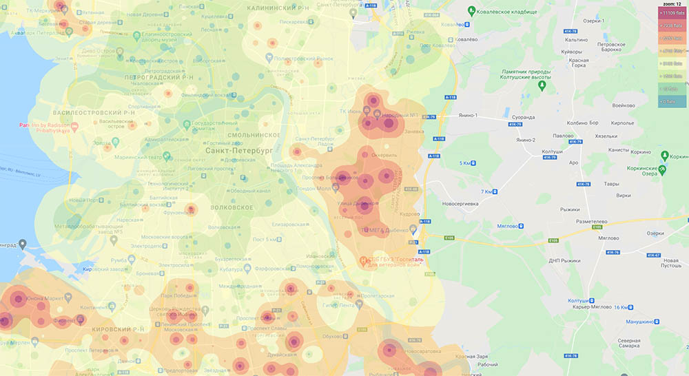

# Flats density heatmap

Generates tiles to display living flats density heatmap for Saint-Petersburg, Russia 
using [Inverse Distance Weighting (IDW) Interpolation](https://gisgeography.com/inverse-distance-weighting-idw-interpolation/).

Can be useful for identifying good places to open pick-up points, food stations, services, etc.



:eyeglasses: **Demo**: https://quex46.github.io/flats-density-heatmap/ (gmaps in development mode and only tiles for zoom 10 and 11 allowed)

## How to use with your own dataset

### 1. Prepare dataset

First, you need a dataset (CSV for Saint-Petersburg is not included).

Format is:

```
year,living_flats,address,latitude,longitude
1862,22,"г. Санкт-Петербург, линия. 10-я В.О., д. 5",59.938284,30.277869
1833,25,"г. Санкт-Петербург, линия. 10-я В.О., д. 7",59.938644,30.277573
1869,6,"г. Санкт-Петербург, линия. 10-я В.О., д. 9, стр. А",59.938861,30.277393
```

Save it under `objects_geocoded.csv` in the project root.

### 2. Provide Google Maps API key

Create file `google.js` under project root:

```js
window.GOOGLE_MAPS_APIKEY = '<YOUR_APIKEY>';
```

### 3. Install Python modules

You'll need at least the following python modules:
- numpy
- pandas
- Pillow

### 4. Generate tiles

```bash
$ python generate_tiles.py
```

Tiles will be saved under `./tiles/` folder.

It may take a lot of time. Tile generation for a city with ~25K objects and 
zooms from 10 to 15 takes about 3-4 hours on a 24-core CPU.

## Licese

See LICENSE.


